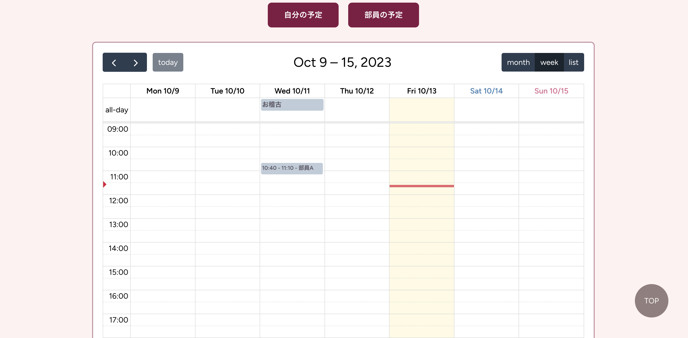
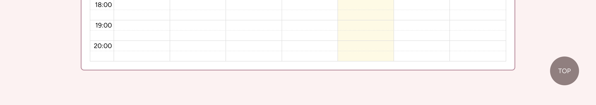
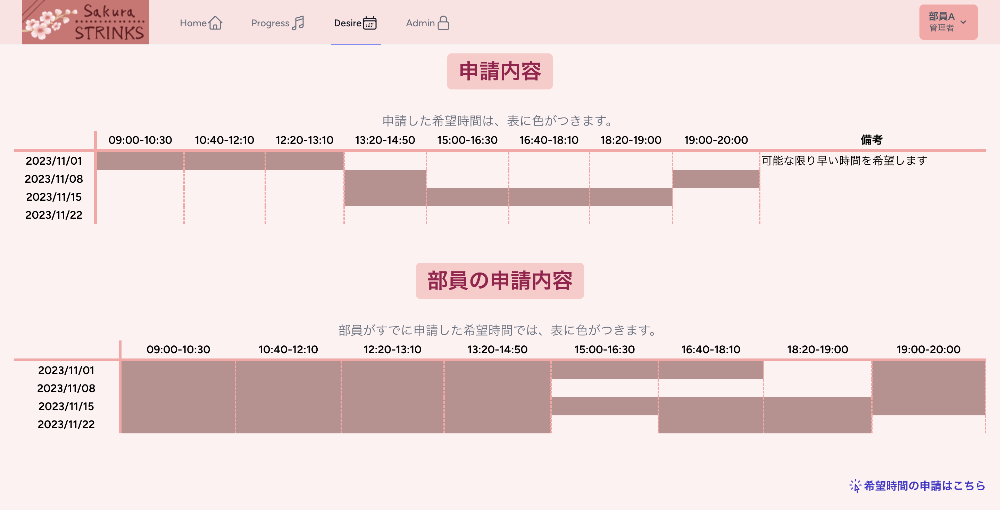

# Sakura STLINKS

## 概要
所属する箏曲部のための、サークル活動サポートアプリ 
個人開発 
制作期間：制作中（2023/7～） 

サイトURL：https://sakurastlinks-8ce811838701.herokuapp.com 
**※ログインが必須となるため、ご覧になりたい場合は以下のテストアカウントにてログインしてください。**
- Name：test
- Email：test@email.com
- Password：test2025

## 制作の動機
部長を務める箏曲部では、以下のような作業をすべて、連絡アプリや口頭で行なっている。 

- お稽古の日時希望のアンケート
- 今月の活動日程の共有
- 現在お稽古中の曲の把握
- 本番で演奏する曲とパートの周知
- お稽古の出欠確認
- お稽古代の計算と周知
- 過去に演奏した曲の把握 etc...

そのため部員も部長も、忙しい毎日の中でアンケートの回答や連絡といった作業を行わなければならない現状があった。 
作業を自動化・効率化してこれらの煩雑さを解決できれば、お箏の練習や部員同士のコミュニケーションといった、最も大切な活動内容に充てられる時間が増加するのではないかと考え、制作するに至った。

 

## 使用技術
- PHP 8.0.2
- HTML/CSS
- JavaScript
- Laravel 9.52.15
- Tailwind 3.3.3
- MySQL 10.2.38
- FullCalendar 6.1.8
- YouTube DATA API v3
- Heroku 
- Heroku Postgres
- GitHub

<!-- ## アーキテクチャ

 -->

## 機能
### 一般ユーザー（部員）
- お知らせ閲覧機能
- お稽古代確認機能
- 活動のカレンダー閲覧機能
- お稽古の進捗の閲覧、登録機能
- 曲目・パート閲覧機能
- お稽古希望日時の申請・申請内容確認機能
- 曲目のYouTube動画視聴機能

### 管理ユーザー（執行代）
一般ユーザーに加えて、以下の機能を有する。 
- お知らせの投稿・編集・削除機能
- 活動日程登録・削除機能
- 曲目・パートの登録機能
- 部員名簿閲覧機能
- お稽古希望日時の閲覧機能
- 曲目のYouTube動画検索機能

### その他
- ログイン機能
- お知らせのページネーション機能
- URLの直打ち防止機能
- 入力フォームのエラーメッセージ機能 etc...

 

## こだわった点
### デザイン
さくらをイメージし、ピンクをテーマカラーとして画面の配色やロゴをデザインした。 
ヘッダーでは、項目にアイコンを加えて見やすくした。 

### 使いやすさ
時間短縮が目的のため、操作性を高めることを意識した。 
- ヘッダーの固定　ーー画面遷移を容易に
- 登録画面のセレクトボックスの連動
ーー曲を選択したらその曲のパートのみが選択できるようにする、スタート時間を選択したらそのあとの時間のみが選択できるようにする、といった仕様に
- 管理者画面のスクロールに合わせて移動するボタン　ーーカレンダーへのイベント登録を容易に

### カレンダー
FullCalendarを導入し、以下の機能を実装した。
- 編集・閲覧の切り替え　ーー部員は閲覧のみ、部長はイベントの登録可
- 終日イベントと時間指定イベントの表示切替　ーーお稽古を行う日と個人のお稽古時間の表示を分ける
- 「自分の予定」「部員の予定」ボタン　ーーデフォルトでは自分のお稽古のみを表示、前後の人の予定も見ることができる
- イベントの色分け　ーー「お稽古」「合奏練習」「その他」でカラーを分類

###YouTube動画
YouTube DATA APIを使用し、以下の機能を実装した。
- 動画検索機能
ーー管理者の曲目登録画面にて、曲名を入力すると、「曲名 + 箏」で検索される
ーー検索結果上位3件が表示され、その画面のまま再生できる
ーーURLをコピーし、曲目登録の際にURLもデータベースに登録できる
ーー検索ボックスで検索した曲名は、曲名登録の入力フォームにそのまま表示される 

またiframeタグを用いて、以下の機能を実装した。
- 動画一覧表示機能
ーー部員はURLが登録された曲の動画一覧画面を閲覧し、その画面のまま再生できる

### URLの直打ち防止
URLを直打ちすることで、以下のことが起きる可能性がある。 
- 部外の他者のアクセス
- 一般ユーザーの管理者画面へのアクセス
そのため、ログイン情報を用いた判定でアクセス権を制御し、情報の信頼性を担保した。 
なお、URLを直打ちするとログイン画面にリダイレクトされるように設定した。

 
### スマホ対応
管理者はPCの使用が主と考えているが、部員は基本的にスマホで利用すると考えられるため、部員が使用する画面はレスポンシブ対応とした。

### 可読性・処理速度
可読性・処理速度を高めるため、コントローラーの共通部分をモデルに関数化した。

 

## 今後追加したい機能
- 一度にすべてのお稽古希望時間を申請できる機能
- カレンダーに部員の授業時間割を表示する機能
- お稽古時間申請に、登録した授業時間割を反映する機能
- お知らせのメール通知機能
- お稽古希望時間申請の締め切り設定機能
- お稽古順案の自動生成機能

 

 ## スクリーンショット
### お稽古進捗状況画面

### お稽古希望時間申請画面

### 管理者画面

 

